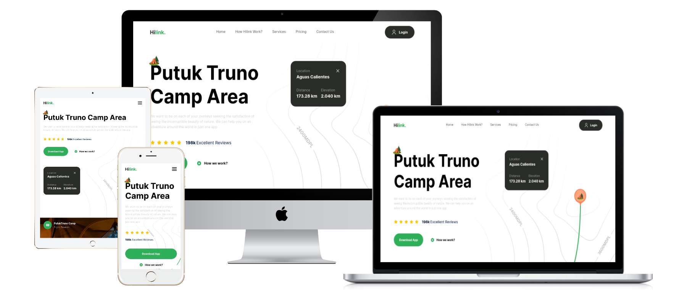

# Travel app landingpage

**Live Preview: [Here](travel-landingpage-git-main-maciejs-projects-7a0c1dd9.vercel.app)**

Fully responsive and modern looking landingpage.

---

**Next13 Project** made as a practice project. There is only first page in the website. In this project I learned how to create modern UI, improve web performance and how to improve code architecture. By this project I betterment my JS,TS and Tailwind skills.   The page is divided into sections:
- Hero,
- Camp,
- Guide,
- Features,
- CTA,

## In project are used: 
- Reuseable components,
- Responsive Web Design (RWD)

## Tools Used
1. JavaScript (Next.js 13)
2. TypeScript
3. Tailwind (Styles)
4. Vercel (Deployment)
5. VSCode (Code Editor)

Deploy on Vercel free,  
[Link to tutorial by JSMastery](https://www.youtube.com/watch?v=cuzw4vL1z5E)
